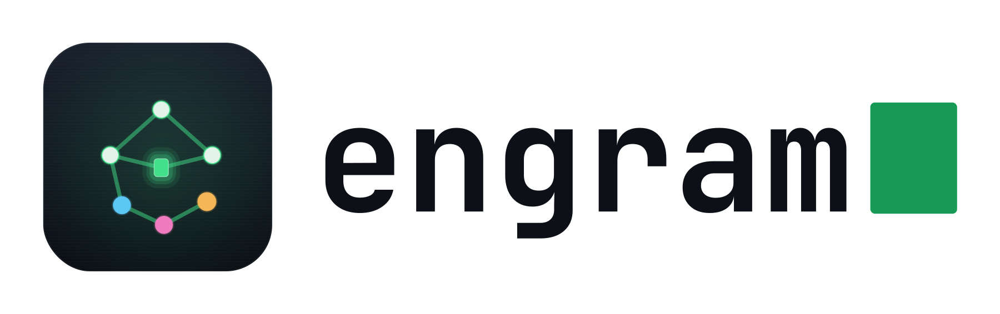
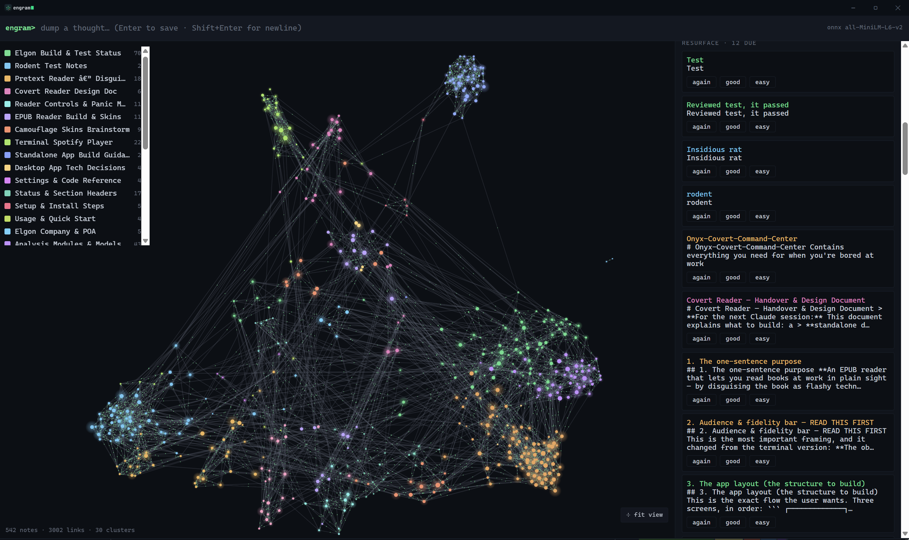
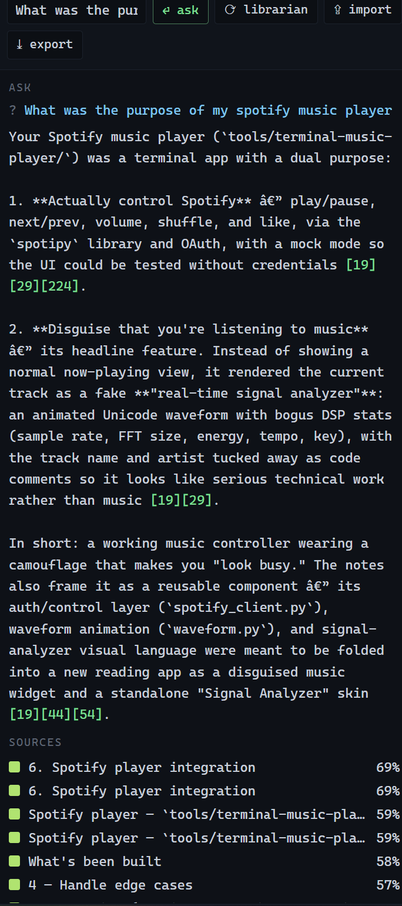

<div align="center">

<picture>
  <source media="(prefers-color-scheme: dark)" srcset="icons/engram-brand/png/engram-logo-horizontal-dark.png">
  
</picture>

### A terminal-themed *second brain* — dump notes, the structure organizes itself.


</div>

---

**engram** is a standalone Windows desktop app. You capture raw thoughts in a
terminal-style bar; it embeds them locally, **auto-links them by meaning**, forms
**emergent clusters** via community detection, and draws an animated, Obsidian-style
**graph of your mind**. Claude is an optional, on-demand *librarian* — naming
clusters, summarizing them, suggesting links, extracting tasks, and answering
questions about your notes — but it's never called automatically.

Everything except the Claude features runs **locally and offline**. No note leaves
your machine unless you press a Claude button or export.

## Screenshots

<!-- Add your own PNGs to docs/screenshots/ (see docs/screenshots/README.md). -->

| The graph | Capture & read |
|:---:|:---:|
|  |  |
| **Ask your notes** | **Clusters** |
|  |  |

## Features

- 🧠 **Frictionless capture** — a terminal prompt; `Enter` saves. Summon anywhere with **Ctrl+Alt+Space**.
- 🔗 **Auto-linking** — local `all-MiniLM-L6-v2` embeddings connect notes by meaning.
- 🌐 **Emergent clusters** — label-propagation community detection, colored on the graph.
- ✨ **Living graph** — nodes float and "fire" like a neural net when idle; sized by content; settles when you interact.
- 🔎 **Semantic search + ask** — instant similarity search, or press Enter to have Claude answer from your notes (with citations).
- 🗂️ **Librarian** — Claude names & summarizes clusters and proposes links/merges into a review panel.
- ✅ **Auto-TODOs** — markdown checkboxes round-trip to disk; Claude extracts implicit tasks, grouped by cluster.
- 🔁 **Spaced repetition** — resurfaces old notes for review.
- 🎴 **Flashcards** — Claude turns a cluster into Q&A cards.
- 📥 **Import** — drag in markdown, text, and **PDFs**; auto-split into notes.
- ⌨️ **Command palette** — **Ctrl+K** to jump to any note or run any action.
- 📦 **Single self-contained `.exe`** — no install, fully portable; export your data to a zip anytime.

## Download

1. Grab the latest **`engram-x.y.z-win-x64.zip`** from the [**Releases**](../../releases) page and unzip it.
2. Run **`engram.exe`** (keep the `models\` and `assets\` folders beside it).

**Requirements**
- Windows 10/11 (x64). Self-contained — no .NET install needed.
- **Microsoft Edge WebView2 Runtime** — preinstalled on Windows 11; [download for Windows 10](https://developer.microsoft.com/microsoft-edge/webview2/).
- The Claude features need the [`claude` CLI](https://docs.claude.com/en/docs/claude-code) signed in; everything else works fully offline.

Your notes live in `%APPDATA%\engram` (markdown files + a SQLite index).

## Build from source

```powershell
# 1. one-time: fetch the local embedding model (~90MB, gitignored)
powershell -File scripts/fetch-model.ps1

# 2. run it
cd src
dotnet run -c Release

# 3. package a release zip (→ dist/engram-<version>-win-x64.zip)
powershell -File scripts/package.ps1
```

Requires the [.NET 8 SDK](https://dotnet.microsoft.com/download/dotnet/8.0).

## How it works

1. **Capture** — note text is written to `notes/{id}.md` and indexed in SQLite.
2. **Embed** — a local ONNX MiniLM model turns it into a 384-d vector.
3. **Link** — cosine similarity above a threshold creates weighted edges.
4. **Cluster** — label-propagation community detection assigns colored clusters.
5. **Librarian** (on demand) — Claude names/summarizes clusters and suggests links.

## Tech

| Layer | Choice |
|---|---|
| Host shell | .NET 8 **WPF**, borderless terminal chrome |
| UI | **WebView2** rendering local HTML/CSS/JS |
| Graph | [`force-graph`](https://github.com/vasturiano/force-graph) |
| Embeddings | **ONNX Runtime** + `all-MiniLM-L6-v2`, fully local |
| Storage | Markdown files + **SQLite** (vectors, edges, clusters, tasks) |
| Librarian / ask | on-demand `claude` CLI |

## Keyboard

| Shortcut | Action |
|---|---|
| **Ctrl+Alt+Space** | Summon the window + focus capture (global) |
| **Enter** / **Shift+Enter** | Save note / newline |
| **Ctrl+K** | Command palette |
| **F** | Fit / reset the graph view |
| **Enter** (in search) | Ask Claude about your notes |

Closing the window hides it to the tray; right-click the tray icon → Exit to quit.

## License

[MIT](LICENSE) © 2026 Karan Kantaria.

The engram logo and icon set (`icons/engram-brand/`) are part of this project.
